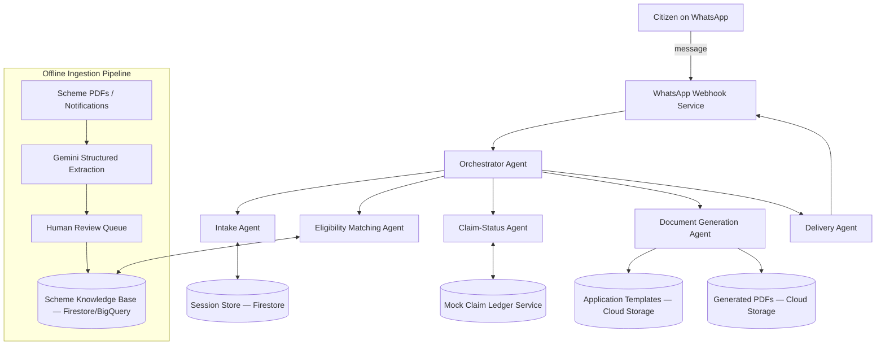

# EntitleMap — Architecture

**Document version:** 1.0
**Companion documents:** `project_overview.md`, `implementation.md`

---

## 1. Architecture Overview

EntitleMap is a multi-agent system orchestrated with Google's Agent Development Kit (ADK), fronted by a WhatsApp conversational interface, backed by a structured scheme knowledge base, and outputting generated documents (PDF/WhatsApp messages).



---

## 2. Components

### 2.1 WhatsApp Webhook Service
- **Responsibility:** Receives inbound WhatsApp messages via the Meta WhatsApp Business Cloud API webhook, verifies the webhook signature, normalizes the payload, and forwards it to the Orchestrator Agent. Sends outbound messages/media on the Orchestrator's behalf.
- **Tech:** Cloud Run (HTTP service), Python (FastAPI).
- **Inputs:** Meta webhook POST payloads (text, interactive button replies).
- **Outputs:** Normalized `InboundMessage` events published to Pub/Sub topic `entitlemap.inbound`.

### 2.2 Orchestrator Agent
- **Responsibility:** The top-level ADK agent. Owns conversation state machine, routes each turn to the correct sub-agent, and assembles the final response.
- **Tech:** ADK `LlmAgent` (Gemini 2.0/2.5 Flash) configured as a router/orchestrator with sub-agents registered as ADK tools.
- **State machine phases:** `LANGUAGE_SELECT → PROFILE_INTAKE → MATCHING → CLAIM_CONFIRMATION → DOCUMENT_GENERATION → DELIVERY → COMPLETE`.
- **Inputs:** `InboundMessage`, current `ConversationSession`.
- **Outputs:** `OutboundMessage(s)`, updated `ConversationSession`.

### 2.3 Intake Agent
- **Responsibility:** Conducts the slot-filling conversation that builds a `CitizenProfile`. Handles language detection/response generation in the citizen's selected language. Validates each answer (e.g., income must be numeric, age must be a plausible integer) and re-prompts on invalid input.
- **Tech:** ADK sub-agent (Gemini), stateless — reads/writes `ConversationSession` in Firestore.
- **Inputs:** Raw citizen message text, current partial `CitizenProfile`.
- **Outputs:** Updated `CitizenProfile` (partial or complete), next question to ask, or a "profile complete" signal.

### 2.4 Eligibility Matching Agent
- **Responsibility:** Evaluates the completed `CitizenProfile` against every `EligibilityRule` in the Scheme Knowledge Base and returns the list of matched `Scheme` records. This is a **deterministic rules engine**, not an LLM call — matching correctness must be 100% reproducible (see `project_overview.md` §9).
- **Tech:** Python rules-evaluation function (e.g., a small predicate-evaluation engine over normalized JSON rules), exposed as an ADK tool. Runs as a Cloud Function or in-process library called by the Orchestrator.
- **Inputs:** `CitizenProfile`.
- **Outputs:** `List[MatchedScheme]` (scheme ID + which predicate clauses matched, for explainability).

### 2.5 Claim-Status Agent
- **Responsibility:** For each `MatchedScheme`, asks the citizen a yes/no self-declaration question and/or checks the mock `ClaimLedgerService`. Filters `MatchedScheme` list down to unclaimed schemes only.
- **Tech:** ADK sub-agent + a `ClaimLedgerService` client (interface stable, backing implementation mocked — see §7).
- **Inputs:** `List[MatchedScheme]`, citizen ID (phone number hash).
- **Outputs:** `List[UnclaimedScheme]`.

### 2.6 Document Generation Agent
- **Responsibility:** For each `UnclaimedScheme`, generates (a) a plain-language summary in the citizen's language, (b) a document checklist, (c) a pre-filled PDF application draft using the scheme's stored template and the citizen's profile data.
- **Tech:** Gemini for summary text generation; a PDF-filling library (e.g., `pypdf`/`reportlab` or a Jinja2→HTML→PDF pipeline) for the application draft, using the `docx`/`pdf` skill conventions for output quality. Templates stored in Cloud Storage per scheme.
- **Inputs:** `UnclaimedScheme`, `CitizenProfile`, scheme `ApplicationTemplate`.
- **Outputs:** `ApplicationPackage` (summary text, checklist array, PDF file reference).

### 2.7 Delivery Agent
- **Responsibility:** Sends the generated `ApplicationPackage`(s) back to the citizen via WhatsApp (text + PDF media message) and, if requested, assembles a consolidated multi-scheme entitlement report PDF.
- **Tech:** ADK sub-agent, calls the WhatsApp Webhook Service's outbound send function.
- **Inputs:** `List[ApplicationPackage]`.
- **Outputs:** WhatsApp messages with attached media; final `ConversationSession` marked `COMPLETE`.

### 2.8 Offline Scheme Ingestion Pipeline (not part of the live request path)
- **Responsibility:** Converts a raw scheme PDF/notification into a structured `EligibilityRule` + `ApplicationTemplate` entry in the Knowledge Base, with mandatory human review before publishing.
- **Tech:** Gemini structured-output extraction (schema-constrained JSON) → a review queue (a simple internal tool or spreadsheet for the hackathon) → write to Firestore/BigQuery on approval.
- **Inputs:** Scheme PDF/URL.
- **Outputs:** Draft `EligibilityRule` + `ApplicationTemplate` records with `status = PENDING_REVIEW`, promoted to `status = PUBLISHED` after human sign-off.

---

## 3. Data Flow (Step-by-Step)

1. Citizen sends a WhatsApp message → WhatsApp Webhook Service validates and publishes an `InboundMessage` event.
2. Orchestrator Agent loads or creates the `ConversationSession` (Firestore, keyed by phone number hash) and determines the current phase.
3. **Phase `PROFILE_INTAKE`:** Orchestrator delegates to Intake Agent, which asks the next unanswered profile question. Repeats across multiple WhatsApp turns until `CitizenProfile.is_complete == true`.
4. **Phase `MATCHING`:** Orchestrator calls Eligibility Matching Agent once, synchronously, with the completed profile. Returns `List[MatchedScheme]`.
5. **Phase `CLAIM_CONFIRMATION`:** Orchestrator delegates to Claim-Status Agent, which asks one self-declaration question per matched scheme (batched into a single interactive WhatsApp list message where possible) and calls the mock `ClaimLedgerService`.
6. **Phase `DOCUMENT_GENERATION`:** Orchestrator calls Document Generation Agent for each `UnclaimedScheme`, in parallel where the runtime supports it, to build `ApplicationPackage`s.
7. **Phase `DELIVERY`:** Orchestrator delegates to Delivery Agent, which sends each package to the citizen and marks the session `COMPLETE`.
8. All state transitions and generated artifacts are persisted so a citizen can resume a conversation if it's interrupted (session TTL: 7 days).

---

## 4. Data Model

### 4.1 `CitizenProfile`
```json
{
  "citizen_id": "sha256(phone_number)",
  "language": "hi | mr | ta | ... | en",
  "age": "integer",
  "gender": "male | female | other | prefer_not_to_say",
  "state": "string",
  "district": "string",
  "is_rural": "boolean",
  "occupation_category": "farmer | daily_wage_labor | salaried | self_employed | unemployed | student | retired | other",
  "annual_income_band": "below_100000 | 100000_300000 | 300000_800000 | above_800000",
  "social_category": "general | obc | sc | st | other",
  "has_disability": "boolean",
  "disability_percentage": "integer | null",
  "land_owned_acres": "float | null",
  "family_size": "integer",
  "is_complete": "boolean"
}
```

### 4.2 `EligibilityRule`
```json
{
  "scheme_id": "string",
  "scheme_name": "string",
  "category": "income_support | disability | agriculture | housing | education | health | pension | other",
  "jurisdiction": "central | state:<state_name>",
  "predicate": {
    "operator": "AND | OR",
    "conditions": [
      { "field": "annual_income_band", "op": "in", "value": ["below_100000", "100000_300000"] },
      { "field": "social_category", "op": "in", "value": ["sc", "st", "obc"] },
      { "field": "age", "op": ">=", "value": 60 }
    ]
  },
  "source_document_url": "string",
  "last_verified_date": "ISO-8601 date",
  "status": "PENDING_REVIEW | PUBLISHED | DEPRECATED"
}
```

### 4.3 `ApplicationTemplate`
```json
{
  "scheme_id": "string",
  "required_documents": ["Aadhaar card copy", "Income certificate", "..."],
  "template_file_ref": "gs://entitlemap-templates/<scheme_id>/template.pdf",
  "field_mapping": {
    "applicant_name": "citizen_profile.name",
    "applicant_age": "citizen_profile.age"
  }
}
```

### 4.4 `MatchedScheme` / `UnclaimedScheme`
```json
{
  "scheme_id": "string",
  "scheme_name": "string",
  "matched_conditions": ["age >= 60", "social_category in [sc, st]"],
  "claim_status": "unclaimed | already_claiming | unknown"
}
```

### 4.5 `ApplicationPackage`
```json
{
  "scheme_id": "string",
  "summary_text": "string (citizen's language)",
  "checklist": ["string", "..."],
  "pdf_file_ref": "gs://entitlemap-generated/<citizen_id>/<scheme_id>.pdf"
}
```

### 4.6 `ConversationSession`
```json
{
  "citizen_id": "string",
  "phase": "LANGUAGE_SELECT | PROFILE_INTAKE | MATCHING | CLAIM_CONFIRMATION | DOCUMENT_GENERATION | DELIVERY | COMPLETE",
  "citizen_profile": "CitizenProfile",
  "matched_schemes": "MatchedScheme[]",
  "unclaimed_schemes": "UnclaimedScheme[]",
  "created_at": "timestamp",
  "updated_at": "timestamp",
  "ttl_expires_at": "timestamp"
}
```

---

## 5. Knowledge Graph / Rules Engine Design

For the hackathon MVP, the "knowledge graph" is implemented as a **structured document collection with explicit predicate rules**, not a full graph database — this is a deliberate scope decision:

- **Storage:** Firestore collection `schemes`, one document per `EligibilityRule` + embedded `ApplicationTemplate` reference. Optionally mirrored into BigQuery for analytics/reporting.
- **Evaluation:** A pure-function predicate evaluator (`evaluate(rule, profile) -> bool`) with no external calls, so matching is deterministic and unit-testable.
- **Why not a real graph DB (e.g., Neo4j) for the MVP:** Scheme eligibility is fundamentally a flat predicate-matching problem (profile attributes → boolean rule), not a graph-traversal problem. A graph DB adds operational complexity without functional benefit at this scale. **Documented upgrade path:** if cross-scheme relationships become a feature (e.g., "schemes that conflict with each other" or "schemes that require another scheme's certificate first"), migrate to a graph model at that point — not before.

---

## 6. Tech Stack

| Layer | Choice | Rationale |
|---|---|---|
| Agent orchestration | Google ADK, Gemini 2.0/2.5 Flash | Matches user's existing ADK expertise; fast iteration for hackathon |
| Compute | Cloud Run | Serverless, scales to zero, fast deploy |
| Messaging channel | WhatsApp Business Cloud API (Meta) | Free tier available, matches target user reachability |
| Session/state store | Firestore | Low-latency document store, fits session + scheme data well |
| Async task glue | Cloud Pub/Sub | Decouples webhook ingestion from agent processing |
| File storage | Cloud Storage | Templates and generated PDFs |
| PDF generation | Jinja2 (HTML template) → WeasyPrint, or `pypdf` for direct form-fill | Reliable, scriptable, no external paid API needed |
| Scheme ingestion (offline) | Gemini structured extraction + human review | Fast to build, avoids the cost/time of a fine-tuned NER model for a hackathon timeline |
| Language handling | Gemini multilingual generation/translation | Avoids maintaining separate translation infrastructure |
| Hosting/infra-as-code | Cloud Run YAML + a single `deploy.sh` (Terraform optional stretch) | Keeps hackathon deploy simple and repeatable |

---

## 7. External Integrations, Mocks, and Their Production Path

| Integration | Hackathon implementation | Production path (post-hackathon) |
|---|---|---|
| Aadhaar identity verification | Not implemented; self-declared profile only | Requires UIDAI AUA/KUA empanelment — a legal/commercial process, out of scope for this project's current stage |
| DBT claim ledger | `ClaimLedgerService` interface backed by an in-memory/Firestore mock returning `unknown` by default, plus citizen self-declaration | Requires a data-sharing agreement with the National Payments Corporation of India / relevant ministry DBT cell |
| Scheme eligibility source data | Manually curated + Gemini-assisted extraction from ~25–40 real scheme PDFs, human-reviewed before publish | Scale ingestion pipeline with a review team/crowdsourced verification model to reach 500+ schemes |
| WhatsApp messaging | Meta WhatsApp Business Cloud API, test/sandbox number | Apply for a verified WhatsApp Business Account and official display name post-hackathon |

The `ClaimLedgerService` is defined as an interface (see `implementation.md` §6) specifically so the mock can be swapped for a real integration without touching any calling code.

---

## 8. Security and Privacy

- **PII minimization:** Only the fields listed in `CitizenProfile` are collected — no full name, no Aadhaar number, no bank details are ever requested or stored (name, if used for a pre-filled form, is collected only at the document-generation step and not persisted beyond the session TTL).
- **Identifier hashing:** The citizen's phone number is never stored in plaintext as the primary key; it is hashed (SHA-256) to form `citizen_id`. The raw phone number is retained only transiently by the WhatsApp Webhook Service to send replies, and is not written to the `ConversationSession` document.
- **Data retention:** `ConversationSession` documents auto-expire via Firestore TTL after 7 days. Generated PDFs in Cloud Storage are deleted after 30 days via a lifecycle rule.
- **Consent:** The first message in every conversation includes a plain-language consent notice stating what data is collected, why, and that it is not shared with any third party, before any profile question is asked.
- **Transport security:** All webhook traffic is HTTPS; the Meta webhook signature is verified on every inbound request to prevent spoofed messages.
- **No legal-advice liability exposure:** Every generated summary and PDF includes a fixed disclaimer: "This is a draft based on self-declared information and publicly available scheme rules. Please verify details with the issuing department before submission."

---

## 9. Non-Functional Requirements

| Requirement | Demo target | Notes |
|---|---|---|
| Latency per conversational turn | < 3 seconds | Gemini Flash tier chosen for this reason |
| End-to-end (profile complete → documents delivered) | < 15 seconds | Parallelize Document Generation Agent calls across matched schemes |
| Availability | Best-effort for demo; no SLA | Cloud Run's default scaling is sufficient |
| Concurrency | Support ≥ 20 simultaneous demo conversations | Cloud Run auto-scales; Firestore handles this volume trivially |
| Scheme knowledge base size (demo) | 25–40 schemes | Sized for judgeable breadth without ingestion-pipeline overbuild |
| Scheme knowledge base size (designed ceiling) | 500+ (architecturally, not populated for demo) | Firestore/BigQuery both scale well past this; no re-architecture needed to grow the dataset |

---

## 10. Failure Modes and Fallback Behavior

| Failure | Detection | Fallback |
|---|---|---|
| WhatsApp API rate-limited or down | HTTP error from Meta API | Queue outbound messages in Pub/Sub with retry/backoff; notify citizen via next successful send that there was a delay |
| Citizen gives an unparseable answer (e.g., non-numeric income) | Intake Agent validation fails | Re-ask the same question with a simplified rephrasing and an example answer |
| No schemes matched | Eligibility Matching Agent returns empty list | Send a clear, non-discouraging message explaining no current matches were found, and log the profile shape (anonymized) for future scheme-coverage analysis |
| Gemini API error/timeout during document generation | Exception caught in Document Generation Agent | Retry once with backoff; on second failure, deliver the checklist and summary (which can be templated without an LLM call) and flag the PDF as "processing — will follow" |
| Duplicate/replay webhook delivery from Meta | Idempotency key check on message ID | Deduplicate using a short-lived Firestore idempotency record keyed by Meta's message ID |
